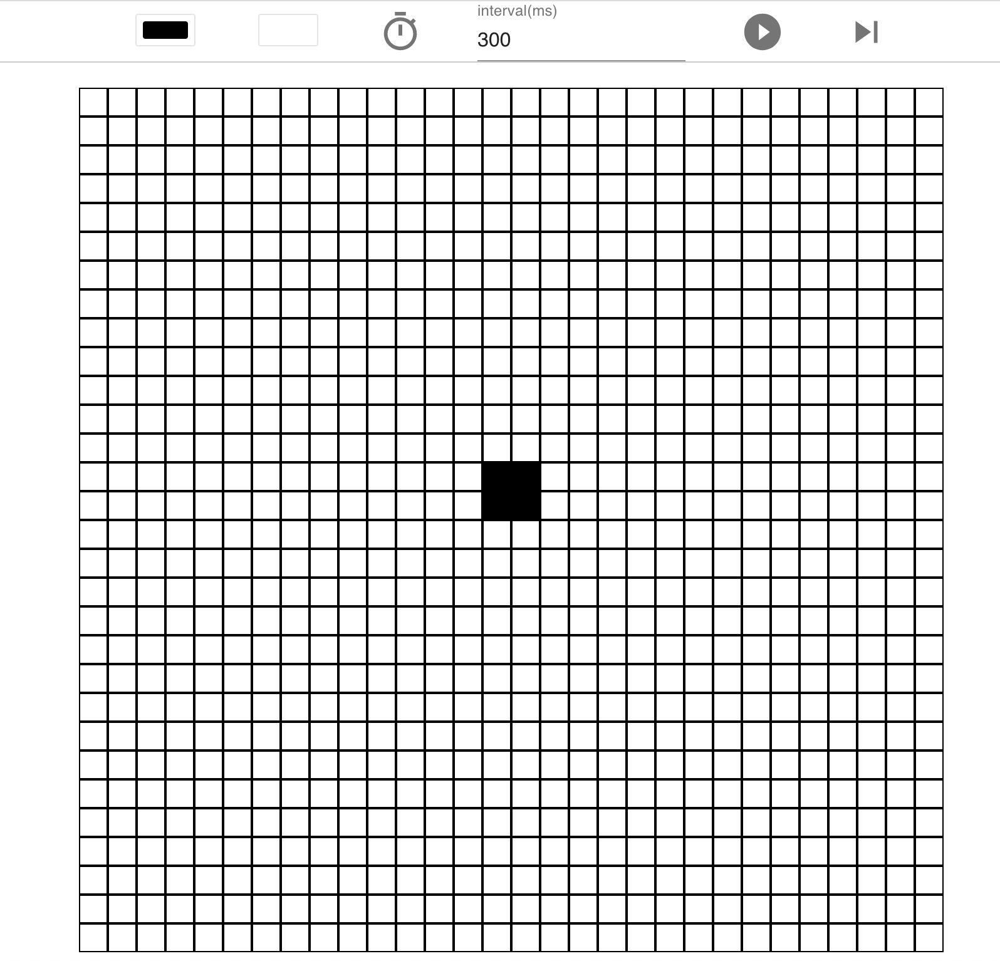

## はじめに
ライフゲームというものをご存知でしょうか。

詳しくはwikipediaを読んでほしいのだが、要はシミュレーションの一種。
https://ja.wikipedia.org/wiki/%E3%83%A9%E3%82%A4%E3%83%95%E3%82%B2%E3%83%BC%E3%83%A0

ほんの僅かな単純な規則から、驚くほど複雑で、まるで生命をもっているかのようなふるまいをすることから、ライフゲームと呼ばれています。

最近、reactを使う現場に入ったこともあり、それまでモダンなJavaScriptをほとんど書いたことがなかったため、いい機会だと思い、ライフゲームを作ってみました。

## ライフゲームとは
ライフゲームは極めてシンプル。ルールはたったの4つだけ。

1. **誕生**: 死んでいるセルに隣接する生きたセルがちょうど3つあれば、次の世代が誕生する
2. **生存**: 生きているセルに隣接する生きたセルが2つか3つならば、次の世代でも生存する
3. **過疎**: 生きているセルに隣接する生きたセルが1つ以下ならば、過疎により死滅する
4. **過密**: 生きているセルに隣接する生きたセルが4つ以上ならば、過密により死滅する

ルールはたったこれだけなのに、実に奥が深くて、面白い挙動をするんですね。

https://lifegame00001.netlify.com/

僕が作ってみたアプリです。↓で紹介するパターンとかを色々ためしてみると面白いですよ。

## ライフゲームの面白いパターンを解説
ライフゲームの中で生成されるパターンには、すぐに死滅するもの、一定の法則性をもつもの、無限に増えるもの、などなど色々なものがあります。

生き延びる場合のパターンは、おおまかに4つに類別されます。

1. 固定物体
2. 振動子
3. 移動物体
4. 繁殖型

です。一個ずつサンプルを紹介していきます。

### 固定物体

ブロック

### 振動子

ブリンカー

### 移動物体

グライダー

### 繁殖型

宇宙船

## 中二病的解説
エンジニアは中二病気質な人間が多いのか、ライフゲームの中で生まれるパターンのなかには、「イカす」名前をもったものが何個か存在します。これを紹介せずにはいられません。痺れます。

### 銀河
遷移をするさまはまるで銀河のよう。その美しい規則性とダイナミックな動きには圧巻、の一言に尽きます。

### ダイハード
Die hardは不死身、とか、しぶとい、という意味ですが、そのぐらい長く残り続ける配置のことです。

### メトセラ
ある特定の配置においては、非常に長い世代を経ないと、死滅しないものが存在します。そういう配置のことを、聖書の**メトセラ**という996歳まで生きた、と言われている人物になぞり、**長寿型（メトセラ）**と名称がついています。かっこいいですよね。

### エデンの園配置
ライフゲームにおいて、最初からそのように設定しない限り、絶対にその配置にはならない配置のことを指します。
聖書で登場するエデンの園が、神がつくったのでなければ、絶対に生まれることはなかったであろう楽園であることから、ライフゲームでのそういう配置のことを「エデンの園配置」と呼ぶそうです。

英名は **Garden of Eden pattern**

https://ja.wikipedia.org/wiki/%E3%82%A8%E3%83%87%E3%83%B3%E3%81%AE%E5%9C%92%E9%85%8D%E7%BD%AE

## 感想

